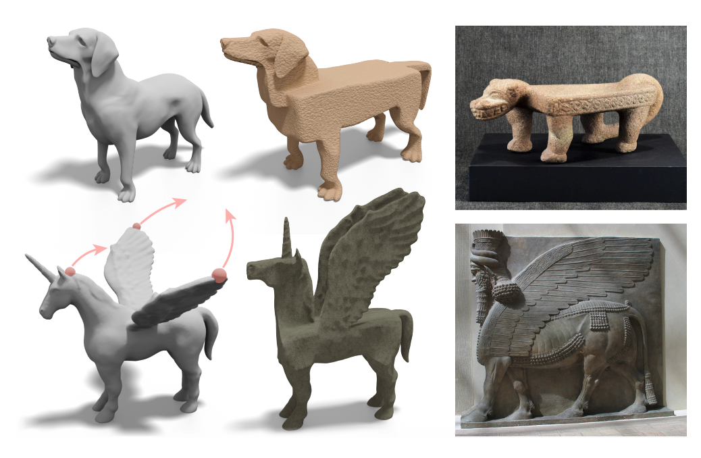
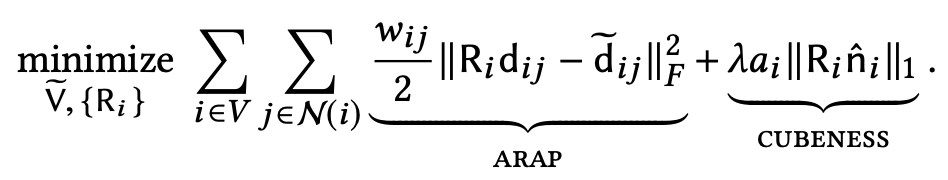
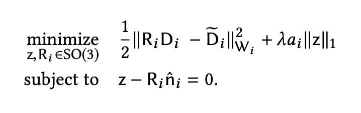
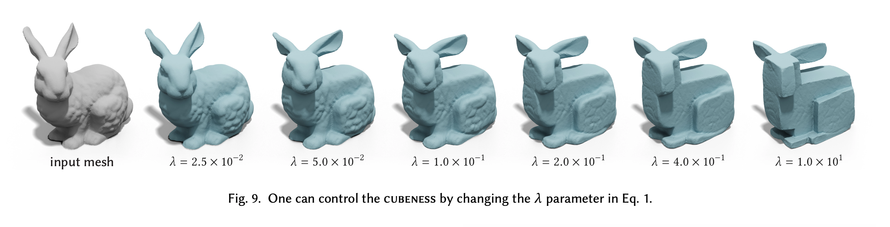
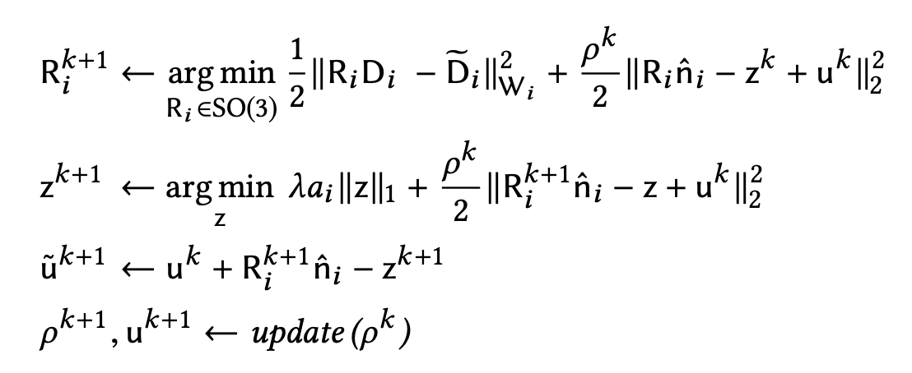
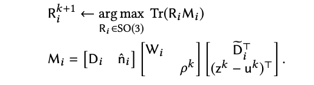
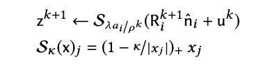
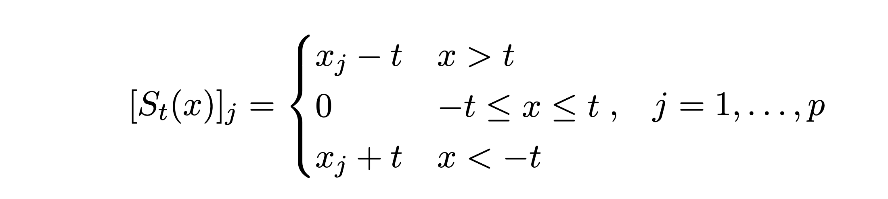
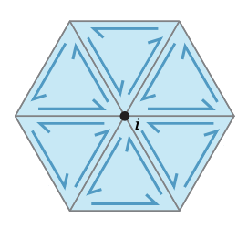

# Geometry Processing - Cubic Stylization

## Execution

```
mkdir build
cd build
cmake ..
make
```

Once built, you can execute the assignment from inside the `build/` by running on a given mesh:

    ./cubicstylization [path to mesh.obj]

## Background

Cubic style art and sculptures have been around for thousands of years.



It has also taken shape in modern day pop-culture. For instance popular video games like Minecraft and Roblox have also adopted this design style:


**Notation**

Intuiitevely we want to deform our mesh into a cube while preserving the integrity of local features, so a good starting candidate would be the ARAP energy.

Let's represent our shape discretely as a [triangle
mesh](https://en.wikipedia.org/wiki/Triangle_mesh) with _rest_ vertices
in  and faces in **F**, where
 is a |**V**| x 3 matrix of vertex positions. Let us denote _V~_ with a tilde to be a |**V**| x 3 matrix containing the deformed vertices.

We also denote **d_ij = (v_j - v_i)** to be the edge vector at the rest state and **d_ij~ = (v_j~ - v_i~)** to be be the edge vector at the deformed state.

## **Cubic Stylization Energy**



The first term is the familiar ARAP energy from the [deformation assignment](https://github.com/alecjacobson/geometry-processing-deformation). The **w_ij** (scalar) term denotes the cotangeant weight between vertex i and j & **N(i)** (vector) denotes the spoke and rim edges of vertex i.

The second term is the **L-1** regularization term that encourages axis alignment (cubeness) of our mesh, where λ controls how much cubiness is done to the mesh. The **a_i** (scalar) term is the barycentric area of vertex i and the **n_i^** (vector) term represents the unit area-weighted normal at vertex i.

In order to find optimal **Ri\*** we adopt the local-global optimization strategy. Since this energy has the additional l1-term we unfortunately cannot minimize this energy in the same manner as ARAP, however, we can transform our energy and formulate it into a ADMM optimization problem by constructing constraint **z = _R_i\*n_i^_**. (for full info on ADMM check out the research paper under ./papers/)

Now we have:



### **Optmization**

**Algorithm**

Pseudocode

```
Cubic Stylization(λ):
    Initialize parameters
    while not converged do:
        R <- local-step(V,V_hat,λ )
        V_hat <- global-step(R)

```



### **Local Step**

**Alternating Direction Method of Mulitpliers** (ADMM)

We formulate our problem into. An optimal **R_i\*** can be found by alternating between minimizing Ri and our constraint z


### Minimizing **R_i** - (**SVD**)

**R_i** can be obtained using Orthogonal Procrustes. We construct matrix **M_i** such that:



**M_i** = **U_i** \* **Σ_i** \* **V_i**.tranpose()

we can find:

**R_i**(k+1) = **V_i** \* **U_i**.transpose()

such that **determinant (** R_i **)** > 0, up to changing the sign of column **U_i**.

### Minimizing **z** - Shrinkage function (lasso problem)

The z step can be solved with this closed form equation using this update step:



The shrink operator can be expanded to be this:



Updating ADMM parameters

```
u = u + R_i * n_i - z
```

### **Precompute**

To improve performancek, we can precompute the values above **W_i**, **D_i**, per vertex i. **D_i** and **D_i~** is our matrix of rims and spoked edge vectors for vertex i. Recall spokes and rim edge vectors are:



We construct **D_i** by first iterating through all the surrounding faces **F** of vertex i and then for each face, find the edge vectors.

```
Initialize W to be |V| x 3|N(i)| matrix
Initialize N to be |V| x |N(i)| matrix
for v in each Vertex:
    F <- find neighboring faces adjacent to i
    for face in F:
        add edge vectors to N_i
        add cotangeant weights to W_i
```

### **Global Step**

### **Helpful Functions From Libigl**

```
igl/massmatrix.h
igl/cotmatrix.h
igl/arap_rhs.h
igl/per_vertex_normals.h
igl/vertex_triangle_adjancency.h
igl/min_quad_with_fixed.h
```

**Convergence**

- Wasn't too sure on how to update the rho & u parameter in ADMM, didn't really mention much in the cubic stylization paper. So I looked it up the ADMM paper, but ran out of time to actually implement it.

**Things I didn't get to impelment**

- Fast cubic stylization (edge collapses)

- Recovering original meshes

- Selective axis/angle cubic stylization

## Tasks

### `source/cubic_syle_precompute.cpp`

Construct precompute data, such as the spokes and rims edge vector matrix, per vertex norms, baycentric area, cotangeant weights, for each vertex i.

### `source/cubic_style_single_iteration.cpp`

Given R, solve the global step by updating new vertices position in **U**.

### `source/cubic_style_local_step.cpp`

Run ADMM on each vertex i until convergeance, alternating between minimizing w.r.t Ri then z.

## Sources

ADMM

```
http://eaton.math.rpi.edu/faculty/Mitchell/courses/matp6600/notes/45c_admm/admm.html

https://github.com/alecjacobson/geometry-processing-deformation

```
